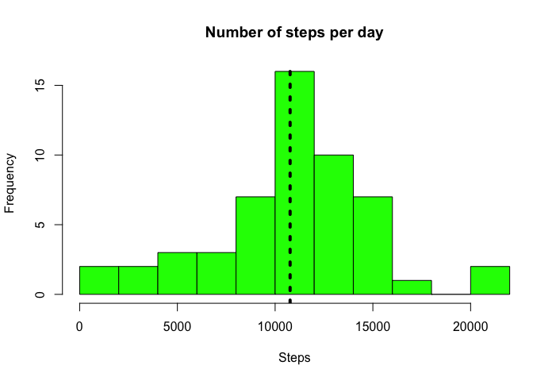
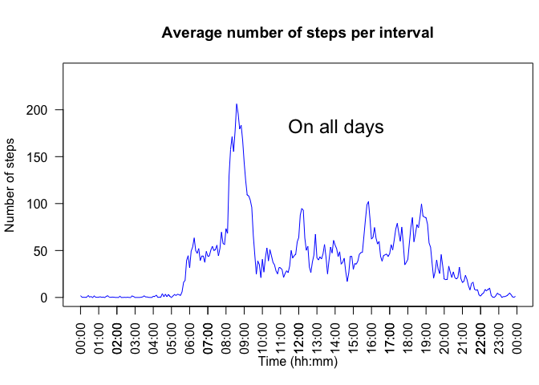
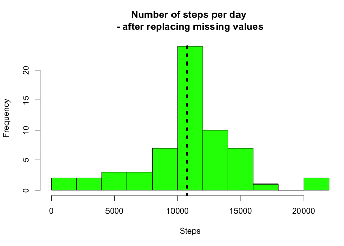
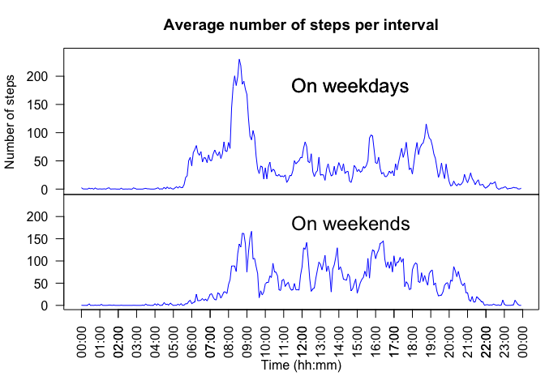

# Reproducible Research: Peer Assessment 1

Author: Jerome Cholewa

## Loading and preprocessing the data
First we set echo = TRUE as default

```r
library(knitr)
opts_chunk$set(echo = TRUE)
```

First we read in the data

```r
movedata <- read.csv("activity.csv")
```
We select only the data without NAs

```r
movedata_noNA <- movedata[!is.na(movedata$steps),]
```
We aggregate the number of steps by day

```r
stepsPerDay <- aggregate(movedata_noNA$steps, by = list(date = movedata_noNA$date), FUN = sum)
names(stepsPerDay)  <- c("Date", "Steps")
```

## What is mean total number of steps taken per day?
We can plot a histogram of the number of steps per day. The dashed line represents the mean.

```r
par(mfrow = c(1,1), mar=c(5.1,4.1,4.1,0.4))
cutpoints  <- quantile (stepsPerDay$Steps, seq(0,1, .1))
with(stepsPerDay, hist(Steps, col = "green",
                    main = "Number of steps per day",
                    xlab = "Steps", breaks  = 10))
abline( v = mean(stepsPerDay$Steps), lty = 3, lwd = 4)
```

 
  
The mean and the median total number of steps per day and very close, yet different.

```r
mean(stepsPerDay$Steps)
```

```
## [1] 10766.19
```

```r
median(stepsPerDay$Steps)
```

```
## [1] 10765
```

## What is the average daily activity pattern?
In order to analyse the daily pattern, I decided to write a function that aggregate the data per each interval and reformats the date (string) and time (integer) as proper dates and times. That way we can plot a time series later.
That function is called `aggregateStepsInt`:

```r
aggregateStepsInt <- function (DF) {
        DFsimple <- DF[,1:3]
        stepsPerInt <- aggregate(DFsimple[,1],
                                 by = list(Interval = DFsimple$interval),
                                 FUN = mean)
        names(stepsPerInt)  <- c("Interval", "AverageSteps")

        # convert interval from integer to string with 4 digits (e.g. "0025")
        stepsPerInt$time <- sprintf("%04d", stepsPerInt$Interval)
        # add a colon after the 2nd digit
        stepsPerInt$time <- sub("^([0-9]{2})([0-9]+)", "\\1:\\2",
                                stepsPerInt$time)
        # convert time from string to time
        stepsPerInt$time <- strptime( stepsPerInt$time, "%H:%M")

        stepsPerInt
        }
```

We will use this function now and later when we compare the data on weekdays and on weekends.
First we apply this function on the original set of data (without NAs)

```r
stepsPerInterval <- aggregateStepsInt(movedata_noNA)
```

That gives a dataframe with 288 observations (288 intervals of 5 minutes in one day) and the number of average steps in each interval.  
In order to plot this time series, I created a plot function (that we will re-use later). This uses the base plot system.

```r
plotStepsInt <- function (DF, plottitle = "") {
        with(DF, plot(time , AverageSteps, col = "blue", type = "l",
                      main = "",
                      yaxt = "n",
                      ylab = "",
                      xlab = "",
                      ylim= c(0,240)))
        #format Y-axis
        yat <- seq(from = 0 , to = 200, by = 50)
        axis(side = 2, at = yat , labels = TRUE)
        #format X-axis
        r <- as.POSIXct(round(range(stepsPerInterval$time), "hours"))
        axis.POSIXct(1, at = seq(r[1], r[2], by = "hour"), format = "%H:%M")
        text(as.POSIXct("11:00", format = "%H:%M"), 180, labels = plottitle, pos = 4, cex = 1.5)
}
```

First we set some parameters and then use my plot function:

```r
par(mfcol= c(1,1), las = 2, mar=c(5.1,4.1,4.1,0.4))
plotStepsInt(stepsPerInterval, "On all days")
title(main="Average number of steps per interval",
      xlab="Time (hh:mm)", ylab = "Number of steps")
```

 

Then we calculate the max of the datasets and select the observation containing that max:

```r
maxSteps <- max(stepsPerInterval$AverageSteps)
stepsPerInterval[stepsPerInterval$AverageSteps == max(stepsPerInterval$AverageSteps),]
```

```
##     Interval AverageSteps                time
## 104      835     206.1698 2015-11-09 08:35:00
```
The max is 206.1698113 and it takes place in the interval of 8:35 am.

## Imputing missing values
We calculate the number of NA values

```r
sum(is.na(movedata$steps))
```

```
## [1] 2304
```

We now need to understand where the missing values are. To that purpose, we will select only the lines of the original dataset with NAs:

```r
movedataNA <- movedata[is.na(movedata$steps),2]
daysNA <- unique(movedataNA)
daysNA
```

```
## [1] 2012-10-01 2012-10-08 2012-11-01 2012-11-04 2012-11-09 2012-11-10
## [7] 2012-11-14 2012-11-30
## 61 Levels: 2012-10-01 2012-10-02 2012-10-03 2012-10-04 ... 2012-11-30
```
Eight days contain NA values. But do some of those days also contain numeric values? Let's find out by selecting the data only on those days and checking for any non-NA values:

```r
movedatadaysNA <- movedata[movedata$date %in% daysNA,]
sum(!is.na(movedatadaysNA$steps))
```

```
## [1] 0
```
Since the sum is 0, that means that those days with some NAs in fact have ONLY NAs. So we cannot replace the NA data by the mean on those respective days. Hence I chose to replace the NAs of a given interval X by the mean of number of steps in that interval X.  
We start by making a copy of the original dataset and running a for-loop on each interval:

```r
movedataFilled <- movedata
for (interv in stepsPerInterval$Interval) {
        movedataFilled[is.na(movedataFilled$steps) & movedataFilled$interval == interv,][,1] <- stepsPerInterval[stepsPerInterval$Interval == interv,2]
}
```

We can now compare the original data with the filled data and the average data

```r
head(movedata[movedata$date == daysNA[1],])
```

```
##   steps       date interval
## 1    NA 2012-10-01        0
## 2    NA 2012-10-01        5
## 3    NA 2012-10-01       10
## 4    NA 2012-10-01       15
## 5    NA 2012-10-01       20
## 6    NA 2012-10-01       25
```

```r
head(movedataFilled[movedataFilled$date == daysNA[1],])
```

```
##       steps       date interval
## 1 1.7169811 2012-10-01        0
## 2 0.3396226 2012-10-01        5
## 3 0.1320755 2012-10-01       10
## 4 0.1509434 2012-10-01       15
## 5 0.0754717 2012-10-01       20
## 6 2.0943396 2012-10-01       25
```

```r
head(stepsPerInterval)
```

```
##   Interval AverageSteps                time
## 1        0    1.7169811 2015-11-09 00:00:00
## 2        5    0.3396226 2015-11-09 00:05:00
## 3       10    0.1320755 2015-11-09 00:10:00
## 4       15    0.1509434 2015-11-09 00:15:00
## 5       20    0.0754717 2015-11-09 00:20:00
## 6       25    2.0943396 2015-11-09 00:25:00
```

We can now aggregate the data per each interval with that new data set:

```r
stepsPerDayFilled <- aggregate(movedataFilled$steps, by = list(date = movedataFilled$date), FUN = sum)
names(stepsPerDayFilled)  <- c("Date", "Steps")
```
We can now plot a similar histogram as before with the misssing data filled in:

```r
cutpointsFilled  <- quantile (stepsPerDayFilled$Steps, seq(0,1, .1))
par(mfrow = c(1,1), mar=c(5.1,4.1,4.1,0.4))
with(stepsPerDayFilled, hist(Steps, col = "green",
                       main = "Number of steps per day \n- after replacing missing values",
                       xlab = "Steps", breaks  = 10))
abline( v = mean(stepsPerDayFilled$Steps), lty = 3, lwd = 4)
```

 
Let's compare the summaries

```r
summary(stepsPerDay)
```

```
##          Date        Steps      
##  2012-10-02: 1   Min.   :   41  
##  2012-10-03: 1   1st Qu.: 8841  
##  2012-10-04: 1   Median :10765  
##  2012-10-05: 1   Mean   :10766  
##  2012-10-06: 1   3rd Qu.:13294  
##  2012-10-07: 1   Max.   :21194  
##  (Other)   :47
```

```r
summary(stepsPerDayFilled)
```

```
##          Date        Steps      
##  2012-10-01: 1   Min.   :   41  
##  2012-10-02: 1   1st Qu.: 9819  
##  2012-10-03: 1   Median :10766  
##  2012-10-04: 1   Mean   :10766  
##  2012-10-05: 1   3rd Qu.:12811  
##  2012-10-06: 1   Max.   :21194  
##  (Other)   :55
```
It increase by 1 unit the median, the mean is still the same, min and max did not move, but the first and 3rd quartile were changed by that manipulation.


## Are there differences in activity patterns between weekdays and weekends?
First we need to create on new variable showing the day of the week, then another factor column indicating whether it is a weekday or a weekend:

```r
movedataFilled$Weekday <- weekdays(strptime(movedataFilled$date, format = "%Y-%m-%d"))
movedataFilled$DayType <- "Weekday" # all days are weekdays by default
# classify Sun and Sat correctly
movedataFilled$DayType[movedataFilled$Weekday %in% c("Saturday", "Sunday")] <- "Weekend"
movedataFilled$DayType <- as.factor(movedataFilled$DayType)
```
We are now separating the data in 2 dataframes and aggregating the data to have the average number of steps per each interval

```r
# separate into 2 dataframes weekdays and weekend
moveWeekDays <- movedataFilled[ movedataFilled$DayType == "Weekday" ,]
moveWeekend <- movedataFilled[ movedataFilled$DayType == "Weekend" ,]
########  average daily activity patterns WeekDays and Weekends####
stepsPerIntWD <- aggregateStepsInt(moveWeekDays)
stepsPerIntWE <- aggregateStepsInt(moveWeekend)
```
Finally we can plot the 2 datasets on top of each other to be able to compare them:

```r
par( xaxt = "n", mar=c(0,4.1,3.1,0.4), mfcol= c(2,1), las = 2)
plotStepsInt(stepsPerIntWD, "On weekdays")
title(main="Average number of steps per interval", ylab = "Number of steps")
text(as.POSIXct("11:00", format = "%H:%M"), 180, labels = "On weekdays", pos = 4, cex = 1.5)
par(xaxt = "s", mar = c(5.1,4.1,0,.4))
plotStepsInt(stepsPerIntWE, "On weekends")
title(xlab = "Time (hh:mm)")
```

 
